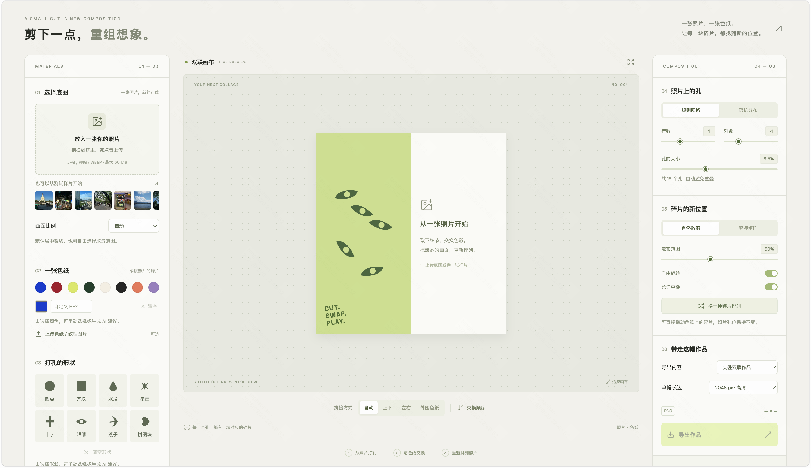
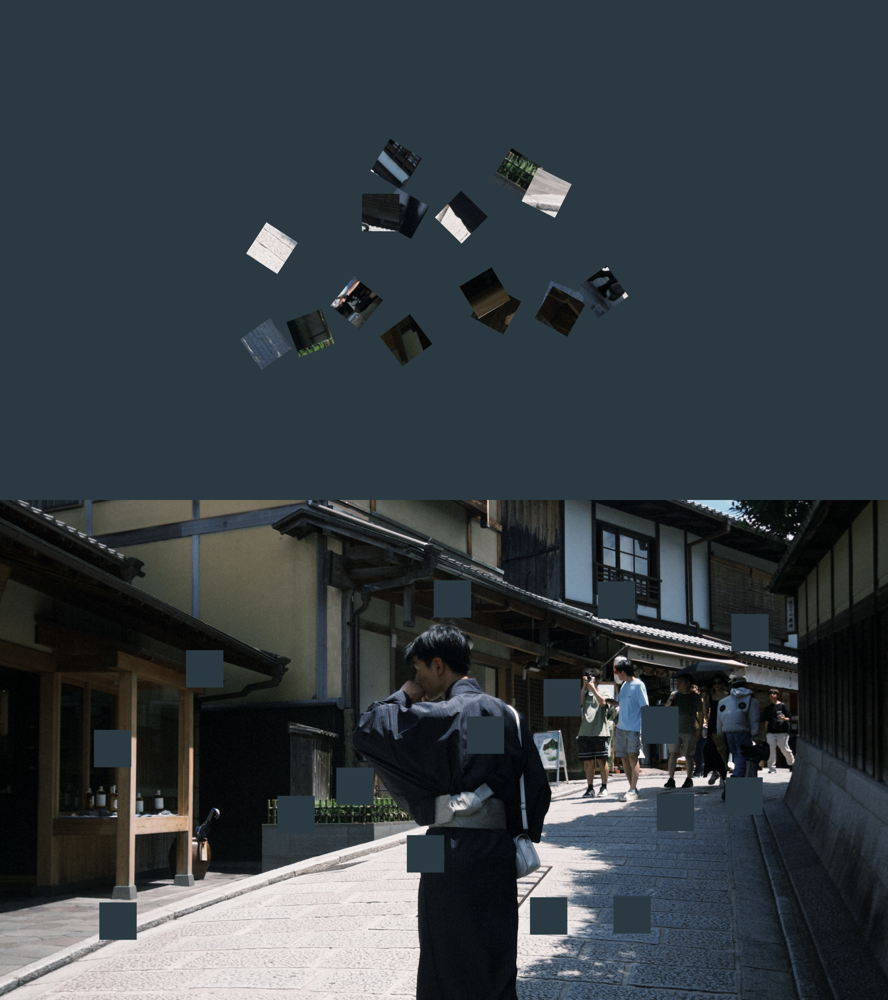
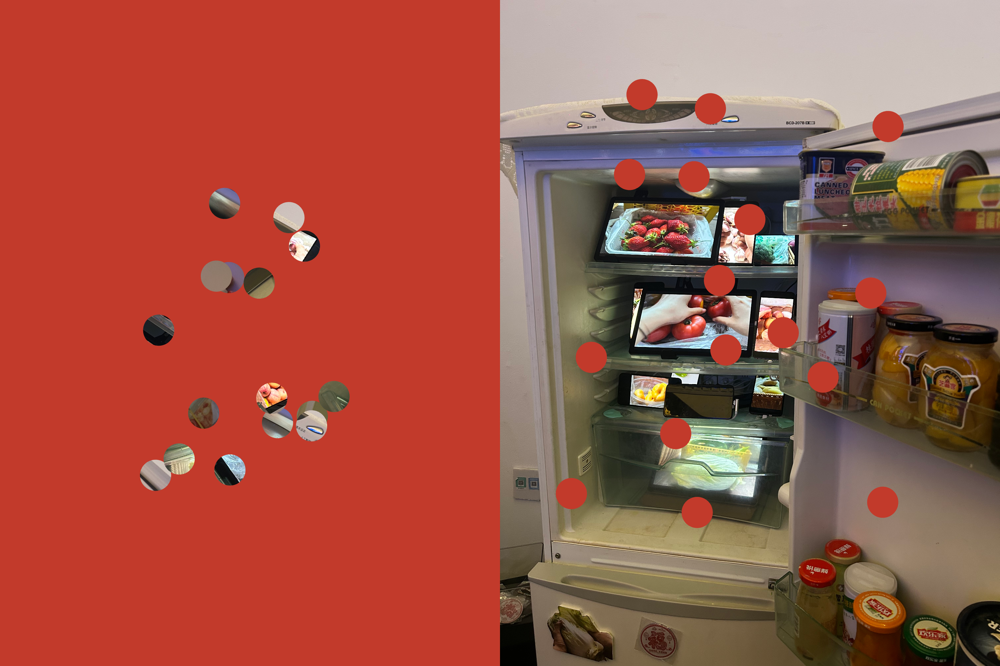

# 赛博打孔器 · Punch Studio

把摄影底图的局部打下来，与色纸交换，再把碎片重新排列。支持本地图片处理、八种内置形状、自由裁剪、两侧拖动、双联或外围色纸拼接、可配置的视觉 LLM 推荐及 PNG 导出。



## 作品案例

同一张照片，一部分留在原处，一部分成为色纸上的碎片。下面三张作品分别展示上下、左右和外围色纸三种拼接方式。

| 方块 · 上下拼接                                                                                   | 圆点 · 左右拼接                                                                                         | 水滴 · 外围色纸                                                                                             |
| ------------------------------------------------------------------------------------------------- | ------------------------------------------------------------------------------------------------------- | ----------------------------------------------------------------------------------------------------------- |
|  |  |  |

## 本地启动

需要 Node.js 24 LTS（最低 22.12）和 npm。克隆后只需安装依赖并启动；无需预先配置密钥，也不需要样本图。

```sh
git clone https://github.com/ironbox-lil/Punch-Studio.git
cd Punch-Studio
npm ci
npm run dev
```

打开 [本地工作台](http://127.0.0.1:5173)。上传自己的 JPG / PNG / WebP 即可制作和导出；未配置密钥时可使用“内置灵感”。Windows、macOS 和 Linux 使用相同的 npm 命令。通过 nvm 管理 Node 时，可先执行 `nvm install && nvm use`。

## 配置自己的 LLM

点击右上角 **LLM 配置**（或灵感面板的“配置模型”），选择 DeepSeek 或 OpenAI 兼容服务，填写 API 根地址、具备图像能力的模型名称和自己的 API Key，再点“保存配置”。

- API 根地址会自动追加 `/chat/completions`，不要填写完整的补全接口。兼容服务需支持 Chat Completions、`image_url` 图像输入及 JSON 输出；并非所有同名兼容接口或模型都支持图像。
- 保存立即生效，无需重启；只有主动生成/重试建议才调用模型。保存只做格式检查，不测试网络连接或模型能力，不产生模型费用。
- 配置保存在本机 `.local/llm.json`，密钥不回显、不保存在浏览器存储中。留空保留已有密钥；“清除已保存密钥”禁用模型调用，不会回退使用旧环境密钥。
- 改 API 地址须重新填写该服务的密钥。远程地址必须是 HTTPS，本机模型服务可使用 `http://127.0.0.1:端口/v1`。当前版本仍要求 API Key 才能调用模型。
- `.local/` 和 `.env.local` 已被 Git 忽略。详情见 [数据与密钥保护](SECURITY.md)。

也可复制 `.env.example` 为 `.env.local` 后配置启动默认值；已有文件时不要覆盖。本机界面保存的配置优先于环境变量。原有 `DEEPSEEK_*` 配置仍兼容。

## 使用

1. 上传 JPG / PNG / WebP 底图，或点击本地测试样片。
   点击“自由裁剪底图”可以移动选区、拖动八个边角手柄、缩放，选择自由比例或锁定预设比例。点击“应用裁剪”后生效；取消/Esc 保留原设置，重置恢复自动居中裁切。
2. 手动选择底色和形状，或点击“生成 AI 建议”让配置的模型补齐空缺。点击候选采用后，三组方案继续保留，可以反复切换对比，无需再次调用 API。
3. 色纸可以上传纹理图片，也可以提取上传图的主色。
4. 分别设置照片孔位与碎片位置；照片上的孔和色纸上的碎片均支持鼠标或触控直接拖动，也可用方向键微调、Shift 加速。拖动中按 Esc 取消，两侧分别提供恢复自动排列的按钮。改变碎片排列不会移动照片孔位。
5. 选择上下、左右或“外围色纸”拼接，导出完整作品、打孔照片或色纸。

“外围色纸”把照片放在中央，在四周增加等宽纯色区域，取出的碎片沿外围散落或环绕排列。外围宽度可设为照片短边的 10%–60%；上传的色纸在此模式下提取主色，也可手动改色。单独导出的外围色纸 PNG 中央透明，便于再次组合。

拖动孔位会实时更新碎片所取的照片内容，保留碎片的位置和旋转，不调用 AI。手动孔位允许重叠，但不能越出照片边界；更改孔位布局、行列数、数量或重新随机排列，会恢复自动孔位。更换底图清空手动孔位，调整裁剪或比例则保留相对位置并约束到边界内。

拖动色纸上的碎片只改变其位置，照片孔位与碎片内容、旋转保持不变。上下、左右及外围拼接均可使用，外围碎片不能拖入中央照片。手动碎片允许重叠；“恢复自动碎片排列”、重排、改变碎片布局/散布范围/重叠设置或孔数会重新自动排列。换底图清空两侧手动位置。改变配色、形状、裁剪或拼接时保留相对位置并约束边界；拖动不会清空已有推荐，也不会调用 API。

支持九种预设比例。自动模式先校正 EXIF 方向，再选择保留面积最大的比例并居中裁切。横图默认上下拼接，竖图默认左右拼接，方图默认上下拼接。

自由比例支持任意矩形选区，自动拼接依据裁剪后的实际比例。裁剪保留原图，可随时重新调整；画布、模型预览和 PNG 导出使用同一选区。“原图尺寸”按当前选区的原生像素计算。更换底图会重置旧选区；取消裁剪不会影响已有推荐，应用新裁剪会使旧推荐失效，但不自动调用模型。

颜色与形状可以分别清空，也可以再次点击已选色块或形状取消选择。“清空颜色和形状”会同时移除上传的色纸，保留底图和布局；随后点击“生成 AI 建议”，即可只根据底图推荐两项。上传、编辑、清空、重排均不会自动调用模型。生成与重试需主动点击，按钮旁会提示 API 费用；“使用内置灵感”无需调用 API。

推荐面板标记当前采用的方案。切换方案只替换该批推荐负责的颜色/形状，生成前手动指定的设置继续保留。“重新生成 AI 建议”沿用这一批的推荐范围；更换素材、改变裁切或手动修改颜色/形状后，旧方案失效，不自动请求新方案。

输入图片上限为 30 MB / 5000 万像素。导出照片长边支持 1024、2048、3072 和原图裁切尺寸（最高 4096）；完整作品包含拼接画面或外围扩展区域，界面展示的是最终 PNG 尺寸。预览使用较小画布，导出会从解码后的原图重新渲染。

## 命令

| 命令                     | 用途                                |
| ------------------------ | ----------------------------------- |
| `npm run dev`            | Vite + API 同源开发服务，自动重载   |
| `npm run check`          | 类型、Lint、单元/接口测试、生产构建 |
| `npm run test:e2e`       | Chromium 交互、像素与导出验收       |
| `npm run format`         | 统一格式                            |
| `npm run format:check`   | 检查格式                            |
| `npm run build`          | 构建浏览器应用和 Node 服务          |
| `npm start`              | 启动生产构建                        |
| `npm run check:repo`     | 检查 Git 暂存区中的密钥和私有文件   |
| `npm run package:source` | 从已检查的暂存区生成干净源码 ZIP    |

第一次运行浏览器测试前执行 `npx playwright install chromium`；Linux CI 使用 `npx playwright install --with-deps chromium`。

生产运行需保留运行时依赖和 `dist`、`dist-server` 两个目录，从项目根目录运行 `npm start`。服务默认仅监听 `127.0.0.1`。可通过 `PORT` 修改端口，通过 `HOST` 修改监听地址。

生产模式完整命令：

```sh
npm ci
npm run build
npm start
```

LLM 配置接口只允许本机连接。本项目面向本机单用户工作台，尚未提供公共服务所需的账户隔离。

## 项目结构

```text
src/
  domain/         纯函数：比例、形状、布局、场景模型
  imaging/        图片解码、主色提取、Canvas 渲染及导出
  editor/         编辑状态、异步资源生命周期、推荐请求
  components/     素材、画布、布局和通用控件
shared/           前后端共用的形状枚举、Zod 接口协议
server/           Express API、输入校验、LLM 适配器和本机配置存储
tests/
  unit/           几何与布局不变量
  server/         推荐协议、字段保护、HTTP 边界
  e2e/            真实浏览器交互、像素对应、导出与样片验收
docs/             架构说明、验收记录与公开展示图片
scripts/          仓库检查、源码打包、可选的真实模型验证脚本
```

详细约定见 [架构说明](docs/ARCHITECTURE.md)、[需求文档](REQUIREMENTS.md) 和 [验收记录](docs/ACCEPTANCE.md)。

## 环境变量与数据边界

| 变量              | 默认值 / 用途                               |
| ----------------- | ------------------------------------------- |
| `LLM_PROVIDER`    | `deepseek` 或 `compatible`，默认 `deepseek` |
| `LLM_API_KEY`     | 仅服务端读取，不进入前端                    |
| `LLM_BASE_URL`    | 默认 `https://api.deepseek.com`             |
| `LLM_MODEL`       | 默认 `deepseek-flash`                       |
| `LLM_CONFIG_FILE` | 默认 `.local/llm.json`，本地持久配置        |
| `PORT`            | `5173`                                      |
| `HOST`            | `127.0.0.1`                                 |
| `SAMPLE_DIR`      | 项目根目录的 `base photos`                  |